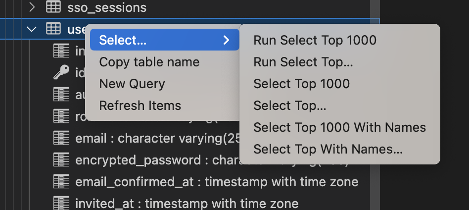
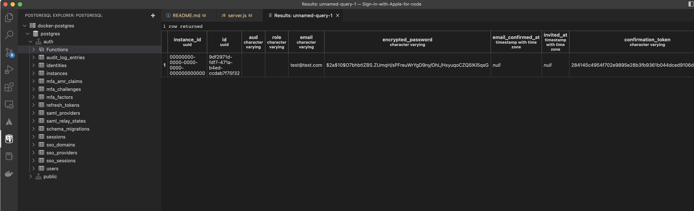

# Sign-in-with-Apple-for-node -  hosted on your own ec2 server for supabase / mobile


## Run Gotrue Docker locally 
```shell
# FOR LOCAL POSTGRES DEV
git clone  https://github.com/supabase/gotrue/
cd gotrue
# FIX THE docker-compose-dev.yaml -> docker-compose.yaml
cp docker-compose-dev.yaml docker-compose.yaml
cp example.docker.env .env.docker
docker compose up
```

## VERIFY gotrue signups are working (this will also create the necessary tables to select from)
```shell
 curl -X POST -d '{"email":"test@test.com","password":"test1234"}' http://0.0.0.0:9999/signup
```
```javascript
{"id":"9df2971d-fdf7-471a-b4ed-ccdab7f75f32","aud":"","role":"","email":"test@test.com","phone":"","confirmation_sent_at":"2022-11-14T02:46:04.177563533Z","app_metadata":{"provider":"email","providers":["email"]},"user_metadata":{},"identities":[{"id":"9df2971d-fdf7-471a-b4ed-ccdab7f75f32","user_id":"9df2971d-fdf7-471a-b4ed-ccdab7f75f32","identity_data":{"email":"test@test.com","sub":"9df2971d-fdf7-471a-b4ed-ccdab7f75f32"},"provider":"email","last_sign_in_at":"2022-11-14T02:46:04.175077127Z","created_at":"2022-11-14T02:46:04.175145Z","updated_at":"2022-11-14T02:46:04.175147Z"}],"created_at":"2022-11-14T02:46:04.168506Z","updated_at":"2022-11-14T02:46:04.177712Z"}%
```




```shell
git clone https://github.com/johndpope/Sign-in-with-Apple-for-node.git
cd Sign-in-with-Apple-for-node
# FOLLOW INSTRUCTIONS in server.js
npm install
npm run start
# open url
127.0.0.1


```
## Verify apple signup with iphone - pass the apple auth code here to create account on supabase
```shell
 curl -X POST -d 'code=cf2add9a5a15842d4b06683fa89152446.0.ntrx.OHzVN63UPWqSjEr-oBsU6g' http://0.0.0.0:80/login/apple

```